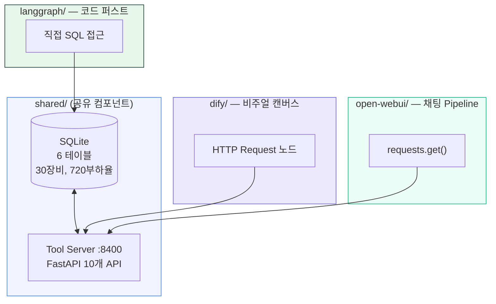
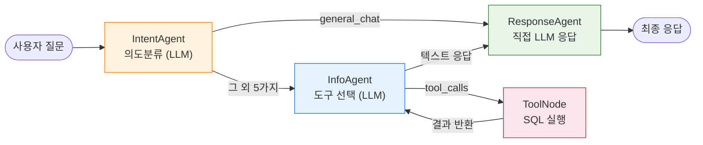
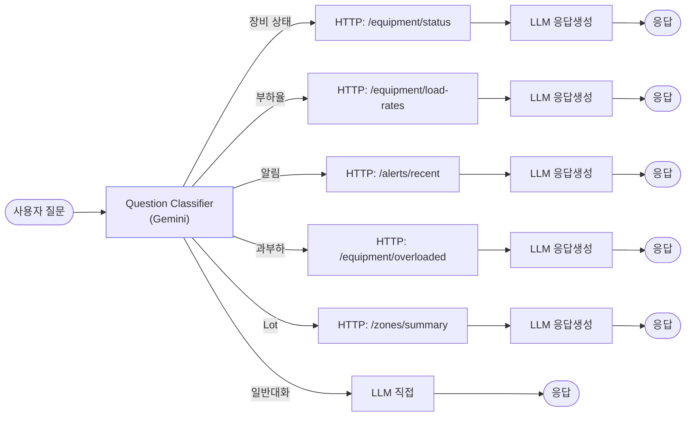
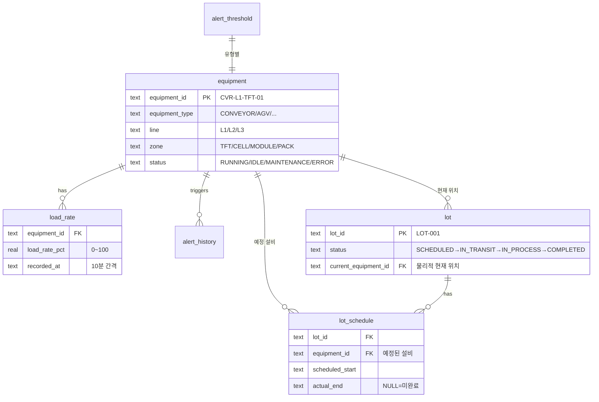

# AI Workflow Compare

> **동일한 유스케이스를 LangGraph / Dify / Open WebUI 3가지로 구현하여 비교**


---

## 유스케이스

**물류 장비 부하율 관리 AI 어시스턴트** — 한국어 자연어 → 의도 분류 → SQL 도구 → 응답 생성

```
"과부하 장비 있어?" → overload_check → get_overloaded_equipment() → "CRITICAL 장비 3대..."
"L1 컨베이어 상태"  → equipment_status → get_equipment_status() → "RUNNING 3대, ERROR 1대"
```

---

## 한눈에 보는 비교

<table>
<tr>
<th width="25%">항목</th>
<th width="25%">LangGraph</th>
<th width="25%">Dify</th>
<th width="25%">Open WebUI</th>
</tr>
<tr>
<td><b>접근 방식</b></td>
<td>Python 코드</td>
<td>비주얼 캔버스 (노코드)</td>
<td>채팅 UI + Pipeline</td>
</tr>
<tr>
<td><b>코드량</b></td>
<td>~600줄</td>
<td>~0줄 (YAML 설정)</td>
<td>~150줄</td>
</tr>
<tr>
<td><b>도구 선택</b></td>
<td>LLM이 10개 중 자율 선택</td>
<td>워크플로우 고정 라우팅</td>
<td>의도→엔드포인트 매핑</td>
</tr>
<tr>
<td><b>유연성</b></td>
<td>&#11088;&#11088;&#11088; 최고</td>
<td>&#11088;&#11088; 중간</td>
<td>&#11088;&#11088; 중간</td>
</tr>
<tr>
<td><b>진입장벽</b></td>
<td>높음 (Python 필수)</td>
<td>낮음 (드래그&드롭)</td>
<td>중간</td>
</tr>
<tr>
<td><b>추천 대상</b></td>
<td>개발자, 복잡한 에이전트</td>
<td>비개발자, 빠른 프로토타입</td>
<td>내부 도구, ChatGPT 대체</td>
</tr>
<tr>
<td><b>장점</b></td>
<td>완전 제어, 테스트 용이,<br>동시 도구 호출, 멀티 에이전트</td>
<td>즉시 배포, 내장 모니터링,<br>프롬프트 UI, 노코드</td>
<td>즉시 사용 가능한 UI,<br>Docker 한 줄, 간결한 코드</td>
</tr>
<tr>
<td><b>단점</b></td>
<td>보일러플레이트 많음,<br>LangChain 학습 필요</td>
<td>복잡한 로직 제한,<br>플랫폼 종속</td>
<td>에이전트 패턴 미지원,<br>디버깅 제한적</td>
</tr>
</table>

> 상세 비교: [docs/comparison.md](docs/comparison.md) | 실행 예시: [docs/examples.md](docs/examples.md)

---

## 아키텍처 다이어그램

### 전체 구조



### LangGraph — 멀티 에이전트 플로우



**핵심:** LLM이 10개 도구 중 자율 선택. 모호한 질문 시 2개 동시 호출 가능.

### Dify — 비주얼 워크플로우



**핵심:** 의도별 고정 분기. 코드 없이 캔버스에서 구성.

### Open WebUI — Pipeline


**핵심:** 3단계 파이프라인. 간결하지만 도구 선택이 코드에 고정.

---

## 데모 실행

### 원클릭 데모

```bash
git clone https://github.com/donchoru/ai-workflow-compare.git
cd ai-workflow-compare
export GEMINI_API_KEY="your-key"
./run_demo.sh
```

스크립트가 자동으로: 가상환경 생성 → 의존성 설치 → DB 시드 → Tool Server 기동 → LangGraph 데모 3개 질문 실행

### 수동 실행

```bash
# 가상환경 + 의존성
python3 -m venv .venv && source .venv/bin/activate
pip install -r shared/tool_server/requirements.txt -r langgraph/requirements.txt

# DB 생성
python -m shared.db.seed

# Tool Server (Dify, Open WebUI용)
python -m shared.tool_server.server &

# LangGraph 대화형 CLI
cd langgraph && python main.py
```

### 데모 결과 예시

<details>
<summary><b>"과부하 장비 있어?"</b> — 클릭하여 응답 보기</summary>

```
[의도: overload_check]

| 장비 ID          | 유형      | 라인 | 구간   | 상태  | 부하율(%) |
|-----------------|---------|------|--------|-------|----------|
| CVR-L1-CELL-01  | CONVEYOR | L1   | CELL   | ERROR | 99.8     |
| SHT-L3-CELL-01  | SHUTTLE  | L3   | CELL   | ERROR | 99.3     |
| SHT-L3-MODULE-01| SHUTTLE  | L3   | MODULE | ERROR | 99.2     |
| AGV-L1-CELL-01  | AGV      | L1   | CELL   | ERROR | 99.1     |
| ...             |          |      |        |       |          |
```
</details>

<details>
<summary><b>"L1 컨베이어 상태 어때?"</b> — 클릭하여 응답 보기</summary>

```
[의도: equipment_status]

L1 라인 컨베이어의 상태:

| 상태    | 대수 |
|---------|------|
| RUNNING | 3    |
| ERROR   | 1    |

| 장비 ID         | 유형      | 라인 | 상태    | 구간  |
|----------------|---------|------|---------|-------|
| CVR-L1-CELL-01 | CONVEYOR | L1   | ERROR   | CELL  |
| CVR-L1-PACK-01 | CONVEYOR | L1   | RUNNING | PACK  |
| CVR-L1-TFT-01  | CONVEYOR | L1   | RUNNING | TFT   |
| CVR-L1-TFT-02  | CONVEYOR | L1   | RUNNING | TFT   |
```
</details>

<details>
<summary><b>"안녕하세요"</b> — 클릭하여 응답 보기</summary>

```
[의도: general_chat]

안녕하세요! 무엇을 도와드릴까요?
혹시 물류 장비 관리에 대해 궁금한 점이 있으신가요?
```
</details>

> 3가지 구현별 비교: [docs/examples.md](docs/examples.md)

---

## 프로젝트 구조

```
ai-workflow-compare/
├── README.md
├── run_demo.sh                  # 원클릭 데모 스크립트
├── shared/                      # 공유 컴포넌트
│   ├── db/
│   │   ├── schema.sql           # 6 테이블 (장비, 부하율, 알림, Lot)
│   │   ├── seed.py              # 샘플 데이터 생성
│   │   └── connection.py        # SQLite 연결
│   └── tool_server/
│       └── server.py            # FastAPI REST API (:8400)
│
├── langgraph/                   # 구현 1: LangGraph (~600줄)
│   ├── agents/                  # IntentAgent, InfoAgent, ResponseAgent
│   ├── graph/                   # StateGraph + 조건부 라우팅
│   ├── tools/                   # @tool 10개 (직접 SQL)
│   └── main.py                  # 대화형 CLI
│
├── dify/                        # 구현 2: Dify (~0줄)
│   ├── workflows/equipment-agent.yml   # Dify DSL 워크플로우
│   └── tools/openapi.yaml              # OpenAPI 3.0 스펙
│
├── open-webui/                  # 구현 3: Open WebUI (~150줄)
│   ├── pipelines/equipment_agent.py    # Pipeline 클래스
│   └── docker-compose.yml
│
└── docs/
    ├── comparison.md            # 상세 비교 (7개 관점)
    └── examples.md              # 실행 결과 예시
```

## DB 스키마



## 도구 API (10개)

| # | 도구 | 엔드포인트 | 용도 |
|---|------|-----------|------|
| 1 | get_equipment_list | `GET /tools/equipment/list` | 장비 목록 (필터) |
| 2 | get_equipment_status | `GET /tools/equipment/status` | 상태별 집계 |
| 3 | get_load_rates | `GET /tools/equipment/load-rates` | 부하율 이력 |
| 4 | get_overloaded_equipment | `GET /tools/equipment/overloaded` | 과부하 장비 |
| 5 | get_equipment_detail | `GET /tools/equipment/{id}/detail` | 장비 상세 |
| 6 | get_recent_alerts | `GET /tools/alerts/recent` | 알림 이력 |
| 7 | get_zone_summary | `GET /tools/zones/summary` | 구간별 요약 |
| 8 | get_lots_on_equipment | `GET /tools/lots/on-equipment/{id}` | 물리적 현재 Lot |
| 9 | get_lots_scheduled | `GET /tools/lots/scheduled/{id}` | 예정된 Lot |
| 10 | get_lot_detail | `GET /tools/lots/{id}/detail` | Lot 상세 |

Tool Server 기동 후 **Swagger UI**: http://localhost:8400/docs

---

## 상세 문서

| 문서 | 내용 |
|------|------|
| [docs/comparison.md](docs/comparison.md) | 개발경험, 유연성, 배포, 유지보수, 비용 — 7개 관점 비교 |
| [docs/examples.md](docs/examples.md) | 동일 질문 3개에 대한 각 구현별 응답 비교 |
| [dify/README.md](dify/README.md) | Dify 설정 가이드 |
| [open-webui/README.md](open-webui/README.md) | Open WebUI 설정 가이드 |
