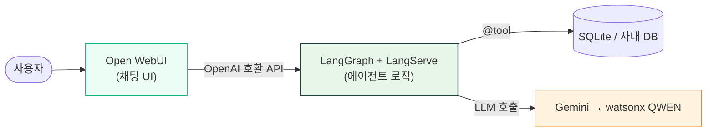
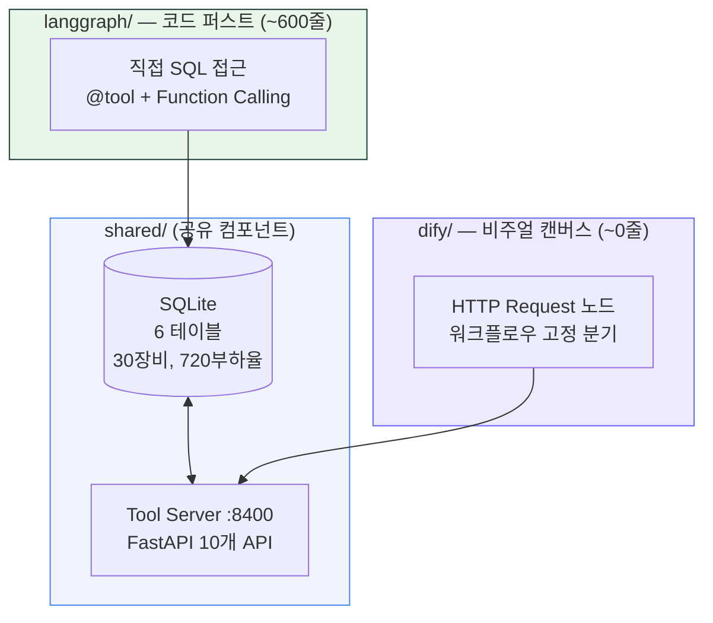
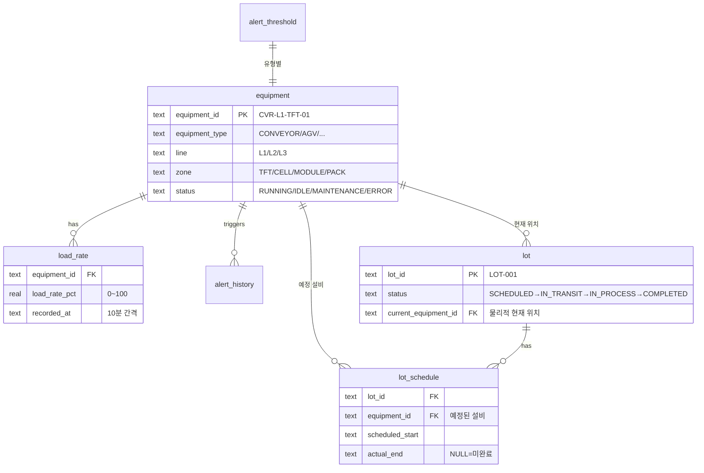
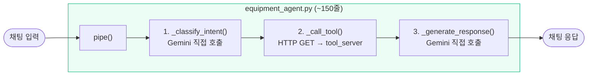

# AI Workflow Compare

> **코드로 짜는 LangGraph vs 드래그&드롭 Dify — 같은 AI 에이전트를 얼마나 다르게 만드는가**


---

## 유스케이스

**물류 장비 부하율 관리 AI 어시스턴트** — 한국어 자연어 → 의도 분류 → SQL 도구 → 응답 생성

```
"과부하 장비 있어?" → overload_check → get_overloaded_equipment() → "CRITICAL 장비 3대..."
"L1 컨베이어 상태"  → equipment_status → get_equipment_status() → "RUNNING 3대, ERROR 1대"
```

---

## 한눈에 보는 비교

<table>
<tr>
<th width="30%">항목</th>
<th width="35%">LangGraph (코드 퍼스트)</th>
<th width="35%">Dify (비주얼 캔버스)</th>
</tr>
<tr>
<td><b>한 줄 요약</b></td>
<td>Python으로 에이전트 로직을 직접 코딩</td>
<td>캔버스에서 노드를 연결하여 워크플로우 구성</td>
</tr>
<tr>
<td><b>코드량</b></td>
<td>~600줄 Python</td>
<td>~0줄 (YAML 설정만)</td>
</tr>
<tr>
<td><b>의도분류</b></td>
<td>IntentAgent — LLM이 JSON으로 구조화</td>
<td>Question Classifier 노드 (내장)</td>
</tr>
<tr>
<td><b>도구 선택</b></td>
<td>LLM이 10개 도구 중 <b>자율 선택</b><br>모호하면 2개 동시 호출</td>
<td>워크플로우에서 <b>고정 분기</b><br>의도 1개 → API 1개</td>
</tr>
<tr>
<td><b>상태 관리</b></td>
<td>TypedDict StateGraph<br>(대화 이력, 의도, 메시지 직접 관리)</td>
<td>자동 (플랫폼 내장)</td>
</tr>
<tr>
<td><b>디버깅</b></td>
<td>FM I/O 트레이스 파일<br>(입출력 전부 기록)</td>
<td>내장 실행 로그 + 노드별 결과</td>
</tr>
<tr>
<td><b>배포</b></td>
<td>Python 스크립트 / LangServe</td>
<td>워크플로우 저장 → API 즉시 노출</td>
</tr>
<tr>
<td><b>장점</b></td>
<td>완전한 코드 제어<br>동시 도구 호출 (모호성 해소)<br>테스트 + Git 자연스러움<br>멀티 에이전트 확장 가능</td>
<td>코드 없이 구성<br>즉시 배포 + API 자동 생성<br>내장 모니터링/비용 추적<br>프롬프트 실시간 수정</td>
</tr>
<tr>
<td><b>단점</b></td>
<td>보일러플레이트 많음<br>LangChain 생태계 학습 필요<br>State 디버깅 복잡</td>
<td>복잡한 로직 표현 한계<br>동적 도구 선택 불가<br>플랫폼 종속 (DSL)</td>
</tr>
<tr>
<td><b>추천 시나리오</b></td>
<td>복잡한 에이전트, 프로덕션,<br>세밀한 제어가 필요한 경우</td>
<td>빠른 프로토타이핑,<br>비개발자 팀, 단순 파이프라인</td>
</tr>
</table>

> 상세 비교: [docs/comparison.md](docs/comparison.md) | 실행 예시: [docs/examples.md](docs/examples.md)

---

## 그래서 뭘 써야 하나? → Open WebUI + LangGraph

이 프로젝트의 비교 결과, **도구 연동이 필요한 AI 챗봇**에는 **Open WebUI + LangGraph** 조합을 선택했습니다.



**왜?**

| 결정 근거 | 설명 |
|-----------|------|
| **도구 자율 선택** | LLM이 10개 도구 중 상황에 맞게 골라 호출. Dify는 워크플로우 고정 분기라 이게 안 됨 |
| **동시 호출** | "설비 Lot 알려줘" → 물리적 위치 + 스케줄 2개 동시 호출. Dify에서는 불가 |
| **LLM 교체 용이** | Gemini → watsonx QWEN 전환 시 `config.py` 1줄 변경 (`langchain-ibm`) |
| **이미 구현됨** | 검증된 에이전트 코드 600줄 재활용 |

> 전체 결정 과정: **[docs/architecture-decision.md](docs/architecture-decision.md)** (ADR)

---

## 아키텍처 다이어그램

### 전체 구조



### LangGraph — 멀티 에이전트 플로우


**핵심:** LLM이 10개 도구 중 자율 선택. 모호한 질문 시 2개 동시 호출 가능.

### Dify — 비주얼 워크플로우


**핵심:** 의도별 고정 분기. 코드 없이 캔버스에서 구성.

---

## 데모 실행

### 원클릭 데모

```bash
git clone https://github.com/donchoru/ai-workflow-compare.git
cd ai-workflow-compare
export GEMINI_API_KEY="your-key"
./run_demo.sh
```

스크립트가 자동으로: 가상환경 생성 → 의존성 설치 → DB 시드 → Tool Server 기동 → LangGraph 데모 3개 질문 실행

### 수동 실행

```bash
# 가상환경 + 의존성
python3 -m venv .venv && source .venv/bin/activate
pip install -r shared/tool_server/requirements.txt -r langgraph/requirements.txt

# DB 생성
python -m shared.db.seed

# Tool Server (Dify, Open WebUI용)
python -m shared.tool_server.server &

# LangGraph 대화형 CLI
cd langgraph && python main.py
```

### 데모 결과 예시

<details>
<summary><b>"과부하 장비 있어?"</b> — 클릭하여 응답 보기</summary>

```
[의도: overload_check]

| 장비 ID          | 유형      | 라인 | 구간   | 상태  | 부하율(%) |
|-----------------|---------|------|--------|-------|----------|
| CVR-L1-CELL-01  | CONVEYOR | L1   | CELL   | ERROR | 99.8     |
| SHT-L3-CELL-01  | SHUTTLE  | L3   | CELL   | ERROR | 99.3     |
| SHT-L3-MODULE-01| SHUTTLE  | L3   | MODULE | ERROR | 99.2     |
| AGV-L1-CELL-01  | AGV      | L1   | CELL   | ERROR | 99.1     |
| ...             |          |      |        |       |          |
```
</details>

<details>
<summary><b>"L1 컨베이어 상태 어때?"</b> — 클릭하여 응답 보기</summary>

```
[의도: equipment_status]

L1 라인 컨베이어의 상태:

| 상태    | 대수 |
|---------|------|
| RUNNING | 3    |
| ERROR   | 1    |

| 장비 ID         | 유형      | 라인 | 상태    | 구간  |
|----------------|---------|------|---------|-------|
| CVR-L1-CELL-01 | CONVEYOR | L1   | ERROR   | CELL  |
| CVR-L1-PACK-01 | CONVEYOR | L1   | RUNNING | PACK  |
| CVR-L1-TFT-01  | CONVEYOR | L1   | RUNNING | TFT   |
| CVR-L1-TFT-02  | CONVEYOR | L1   | RUNNING | TFT   |
```
</details>

<details>
<summary><b>"안녕하세요"</b> — 클릭하여 응답 보기</summary>

```
[의도: general_chat]

안녕하세요! 무엇을 도와드릴까요?
혹시 물류 장비 관리에 대해 궁금한 점이 있으신가요?
```
</details>

> 3가지 구현별 비교: [docs/examples.md](docs/examples.md)

---

## 프로젝트 구조

```
ai-workflow-compare/
├── README.md
├── run_demo.sh                  # 원클릭 데모 스크립트
├── shared/                      # 공유 컴포넌트
│   ├── db/
│   │   ├── schema.sql           # 6 테이블 (장비, 부하율, 알림, Lot)
│   │   ├── seed.py              # 샘플 데이터 생성
│   │   └── connection.py        # SQLite 연결
│   └── tool_server/
│       └── server.py            # FastAPI REST API (:8400)
│
├── langgraph/                   # 구현 1: LangGraph (~600줄)
│   ├── agents/                  # IntentAgent, InfoAgent, ResponseAgent
│   ├── graph/                   # StateGraph + 조건부 라우팅
│   ├── tools/                   # @tool 10개 (직접 SQL)
│   └── main.py                  # 대화형 CLI
│
├── dify/                        # 구현 2: Dify (~0줄)
│   ├── workflows/equipment-agent.yml   # Dify DSL 워크플로우
│   └── tools/openapi.yaml              # OpenAPI 3.0 스펙
│
├── open-webui/                  # 보너스: Open WebUI 채팅 UI
│   ├── pipelines/equipment_agent.py    # Pipeline 클래스
│   └── docker-compose.yml
│
└── docs/
    ├── comparison.md            # 상세 비교 (7개 관점)
    └── examples.md              # 실행 결과 예시
```

## DB 스키마



## 도구 API (10개)

| # | 도구 | 엔드포인트 | 용도 |
|---|------|-----------|------|
| 1 | get_equipment_list | `GET /tools/equipment/list` | 장비 목록 (필터) |
| 2 | get_equipment_status | `GET /tools/equipment/status` | 상태별 집계 |
| 3 | get_load_rates | `GET /tools/equipment/load-rates` | 부하율 이력 |
| 4 | get_overloaded_equipment | `GET /tools/equipment/overloaded` | 과부하 장비 |
| 5 | get_equipment_detail | `GET /tools/equipment/{id}/detail` | 장비 상세 |
| 6 | get_recent_alerts | `GET /tools/alerts/recent` | 알림 이력 |
| 7 | get_zone_summary | `GET /tools/zones/summary` | 구간별 요약 |
| 8 | get_lots_on_equipment | `GET /tools/lots/on-equipment/{id}` | 물리적 현재 Lot |
| 9 | get_lots_scheduled | `GET /tools/lots/scheduled/{id}` | 예정된 Lot |
| 10 | get_lot_detail | `GET /tools/lots/{id}/detail` | Lot 상세 |

Tool Server 기동 후 **Swagger UI**: http://localhost:8400/docs

---

## 상세 문서

| 문서 | 내용 |
|------|------|
| [docs/architecture-decision.md](docs/architecture-decision.md) | **아키텍처 결정 기록 (ADR)** — 왜 Open WebUI + LangGraph인가 |
| [docs/tutorial.md](docs/tutorial.md) | **교육용 튜토리얼** — 학습 경로, 용어 사전, 코드 스니펫, 트레이스 읽는 법 |
| [docs/comparison.md](docs/comparison.md) | LangGraph vs Dify 상세 비교 (7개 관점) |
| [docs/examples.md](docs/examples.md) | 동일 질문 3개에 대한 각 구현별 응답 비교 |
| [docs/traces/](docs/traces/) | FM I/O 트레이스 실물 (에이전트 실행 과정 기록) |
| [dify/README.md](dify/README.md) | Dify 설정 가이드 |
| [open-webui/README.md](open-webui/README.md) | Open WebUI 설정 가이드 |

---

## 보너스: Open WebUI Pipeline

> Open WebUI는 LangGraph/Dify와 **같은 레벨의 비교 대상이 아닙니다.**
> LangGraph와 Dify는 **AI 워크플로우 오케스트레이션 도구**이고,
> Open WebUI는 **채팅 프론트엔드**입니다.
>
> 여기서는 "같은 유스케이스를 채팅 UI에 연결하면 어떤 모습인가"를 보여주기 위해 보너스로 포함했습니다.



| 비교 | LangGraph / Dify | Open WebUI |
|------|-----------------|------------|
| **본질** | 워크플로우 오케스트레이션 | 채팅 프론트엔드 |
| **초점** | 에이전트 로직 설계 | 사용자 인터페이스 |
| **용도** | "AI가 어떻게 생각하고 행동하는가" | "결과를 어떻게 보여주는가" |

실무에서는 LangGraph로 에이전트를 만들고, Open WebUI로 UI를 씌우는 **조합**이 일반적입니다.

설정 가이드: [open-webui/README.md](open-webui/README.md)
